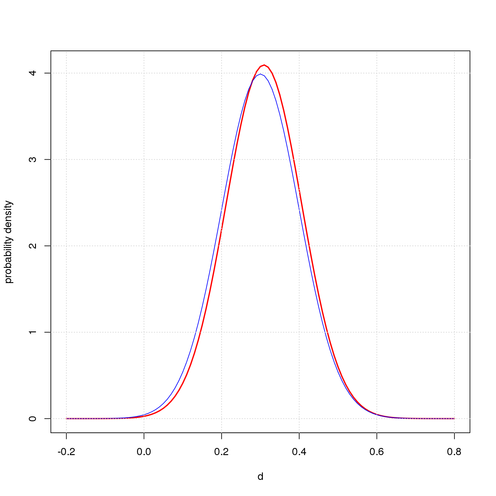
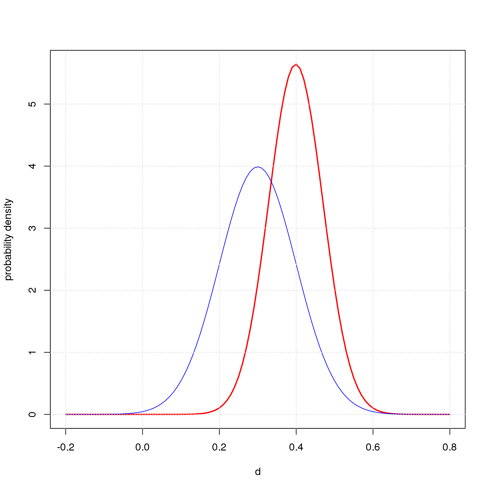

This working paper shows an R implementation of Bayes's formula as used in the blog post [What's the Effect Size?](https://natgoodman.github.io/bayez/effit.stable.html) to estimate true effect size in two group difference-of-mean studies. The main point is that the implementation is really, really simple.  With all the fuss and bother about Bayesian methods, I imagined it would be incredibly hard to code.  Happily not.

## Bayes's Formula

The line of math below is Bayes's formula for the example at hand. An important nuance is that the "probabilities" are *probability densities* - think R's `dnorm`.

$$
P(d_{pop} \mid d_{obs}) = \frac {P(d_{pop}) \times P(d_{obs} \mid d_{pop}) } {P(d_{obs})}
$$

1. The term on the left hand side is what we're trying to compute, namely, the posterior probability distribution of $d_{pop}$ for a given value of $d_{obs}$ ($0.5$ in the blog post's running example). 

2. The first term on the right hand side, $P(d_{pop})$, is the prior. For the normal prior in Figures 1 and 2 of the post, this is R's `dnorm` with $mean=0.3$ and $sd=0.1$.

3. The next term, $P(d_{obs} \mid d_{pop})$, is the probability distribution of $d_{obs}$ for a given $d_{pop}$. For the two group difference-of-mean studies in the post, this is a noncentral t-distribution centered on $d_{obs}$.

4. The denominator, $P(d_{obs})$, is the probability of a given value of $d_{obs}$ across all values of $d_{pop}$. This is the integral from $-\infty$ to $\infty$ of the numerator in Bayes's formula.

## R Implementation

Below is R code to compute the posterior for the examples in this post. The code works: just copy-and-paste into an R session and it'll plot two graphs similar to Figures 1 and 2 in the blog post. The code is also available in the file `R/baysx.R` in my [GitHub repo](https://github.com/natgoodman/bayez).

``` {r eval=FALSE}
## Return function for posterior probability of d.pop given d.obs for two group 
## difference-of-mean studies with equal sample size and unit standard deviation
##   n is sample size per group
##   d.obs is standardized observed effect size
##   prior is function of d.pop, eg, function(d.pop) dnorm(d.pop,mean=0.3,sd=0.1)
##
posterior=function(n,d.obs,prior) {
  ## probability of d.obs given d.pop for examples at hand. dd2t defined below
  P_obsGIVENpop=function(d.pop) dd2t(n,d.pop,d.obs);
  ## numerator in Bayes formula
  numerator=function(d.pop) prior(d.pop)*P_obsGIVENpop(d.pop);
  ## denominator in Bayes formula
  P_obs=integrate(function(d.pop) numerator(d.pop),-Inf,Inf)$value;
  ## final answer
  P_popGIVENobs=function(d.pop) numerator(d.pop)/P_obs;
}

## probability density of noncentral t in terms of n, d.pop, d.obs
##   adapted from https://natgoodman.github.io/repwr/stats.stable.html
dd2t=function(n,d.pop,d.obs) {
  df=2*(n-1);
  t=d.pop*sqrt(n/2);
  sqrt(n/2)*suppressWarnings(dt(t,df=df,ncp=sqrt(n/2)*d.obs));
}

## examples with normal prior as in Figures 1 and 2 of the post
##   each graph plots the posterior for the given value of n, 
##   as well as the prior (dnorm(d.pop,mean=0.3,sd=0.1)) for reference
## n=10
dev.new();
dpost=posterior(n=10,d.obs=0.5,prior=function(d.pop) dnorm(d.pop,mean=0.3,sd=0.1));
curve(dpost,from=-0.2,to=0.8,col='red',lwd=2,xlab='d',ylab='probability density');
curve(dnorm(x,mean=0.3,sd=0.1),col='blue',add=T);
grid();
## n=200;
dev.new();
dpost=posterior(n=200,d.obs=0.5,prior=function(d.pop) dnorm(d.pop,mean=0.3,sd=0.1));
curve(dpost,from=-0.2,to=0.8,col='red',lwd=2,xlab='d',ylab='probability density');
curve(dnorm(x,mean=0.3,sd=0.1),col='blue',add=T);
grid();
```

The resulting graphs are

```{r out.width="50%",echo=FALSE,fig.show='asis'}
;
;
```

The code exploits an advanced R feature that may be unfamiliar to some readers, namely, the ability to treat functions like other kinds of data. You can store a function in a variable, pass a function as an argument to another function, create a new function on-the-fly and store it in a variable, call the newly created function via the variable, and return a function as the result of a function. 

I use this feature repeatedly. 

1. I pass the prior probability function (`dnorm(d.pop,mean=0.3,sd=0.1)`) to `posterior` as the argument `prior`.

2. Each line of `posterior` creates a function: e.g., the line `P_obsGIVENpop=function(d.pop) dd2t(n,d.pop,d.obs);` creates a function of `d.pop` that calls the function `dd2t` on variables `n`, `d.pop`, and `d.obs`. A further detail is that variables `n` and `d.obs` are *bound* to the values passed into `posterior` as arguments, while `d.pop` is *free* and gets its value later when the new function `P_obsGIVENpop` is called.

3. The final result is likewise a function of `d.pop`: `function(d.pop) numerator(d.pop)/P_obs;`

4. The examples store the function in the variable `dpost`, then use `curve` (a base R function) to call `dpost` and plot the result. 

## Web Resources I Found Helpful

The web is awash in Bayesian material, but I found most of it inscrutable. Here are web pages that were simple enough to get me started on the path to understanding. Thanks!  I appreciate the helping hand!

- [Bayesian models in R](https://www.r-bloggers.com/bayesian-models-in-r-2/) by Francisco Lima, posted on R-bloggers

- [Probability concepts explained: Bayesian inference for parameter estimation](https://towardsdatascience.com/90e8930e5348) by Jonny Brooks-Bartlett, posted on Medium.

## Comments Please!

Please post comments on [Twitter](https://twitter.com/gnatgoodman) or [Facebook](https://www.facebook.com/nathan.goodman.3367), or contact me by email [natg@shore.net](mailto:natg@shore.net).
