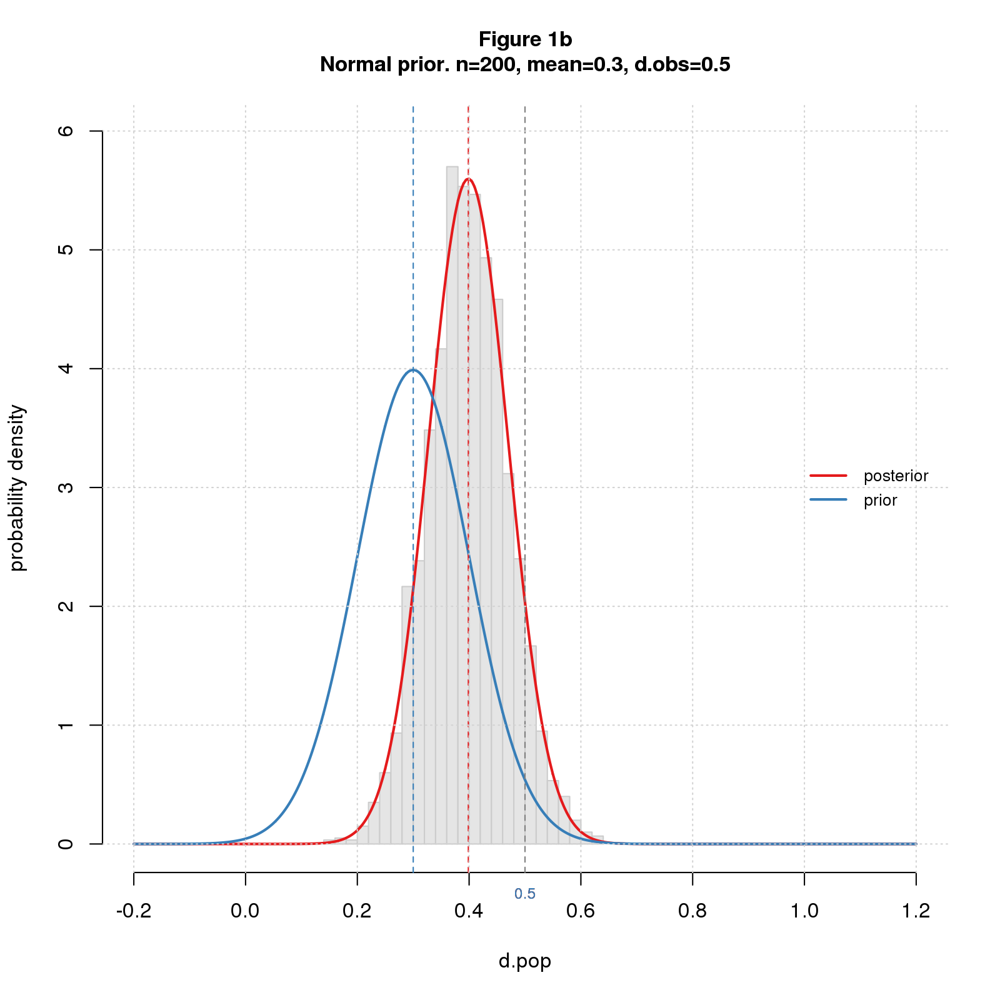
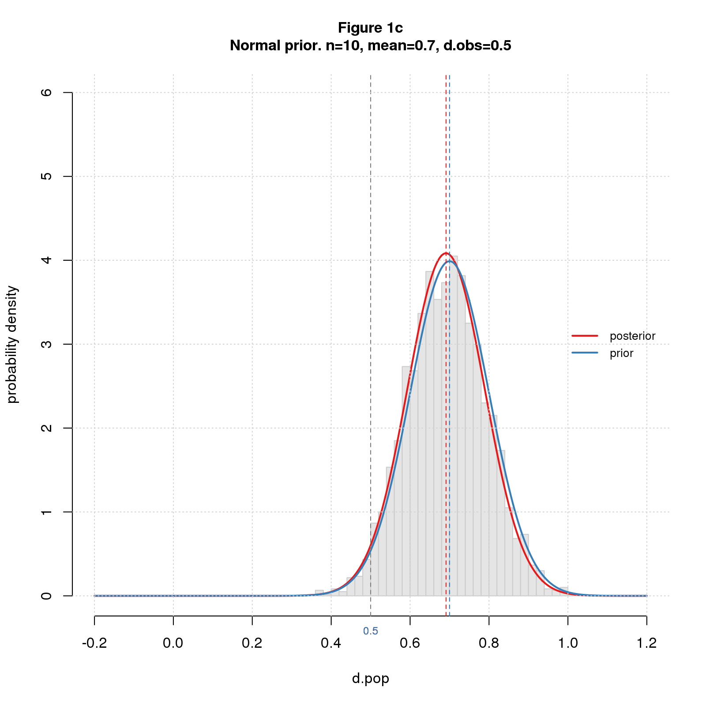
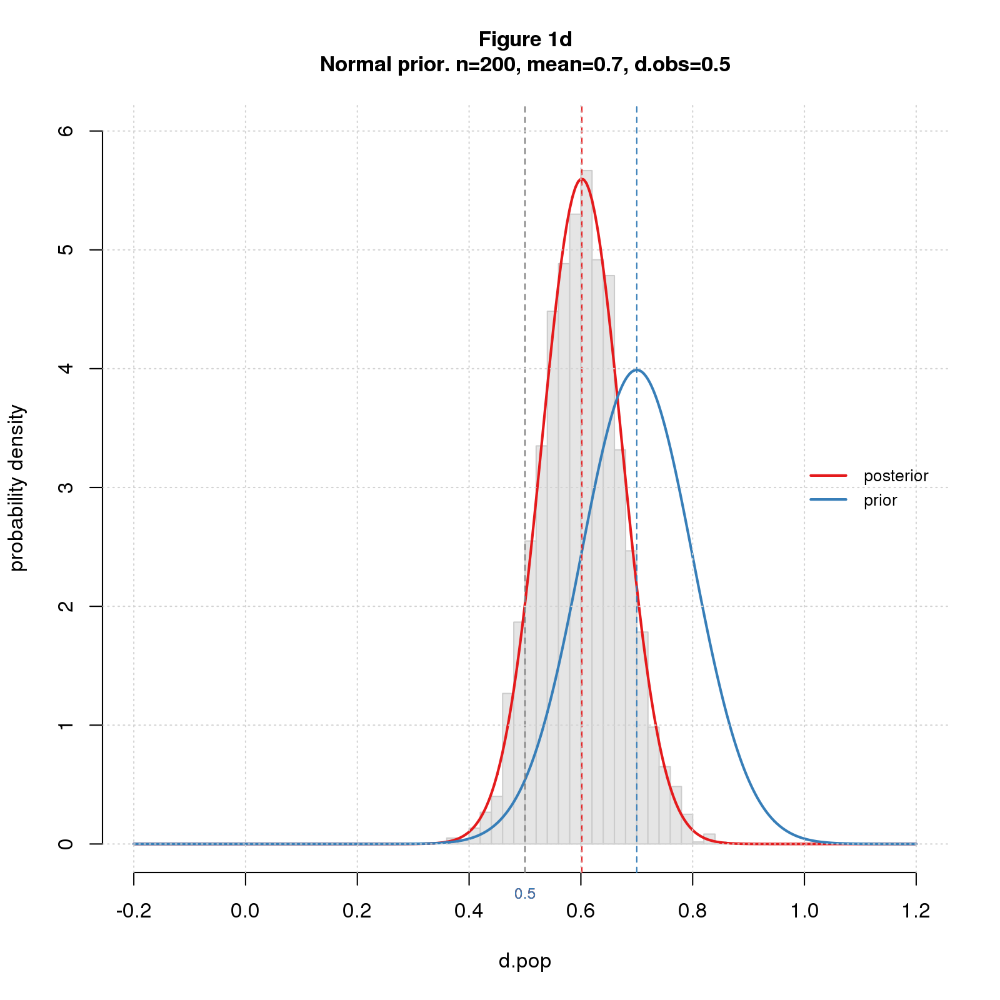
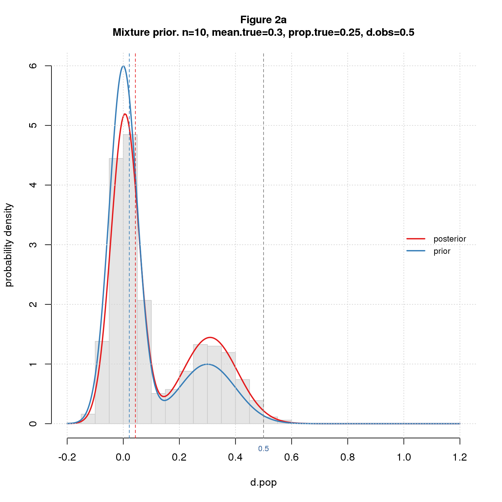
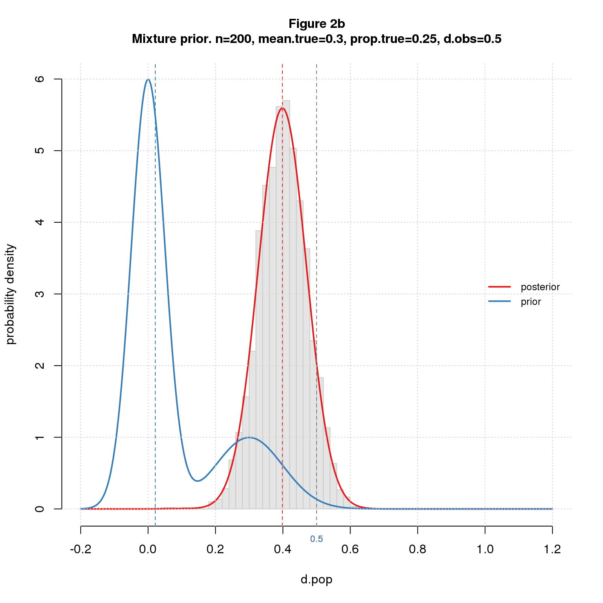
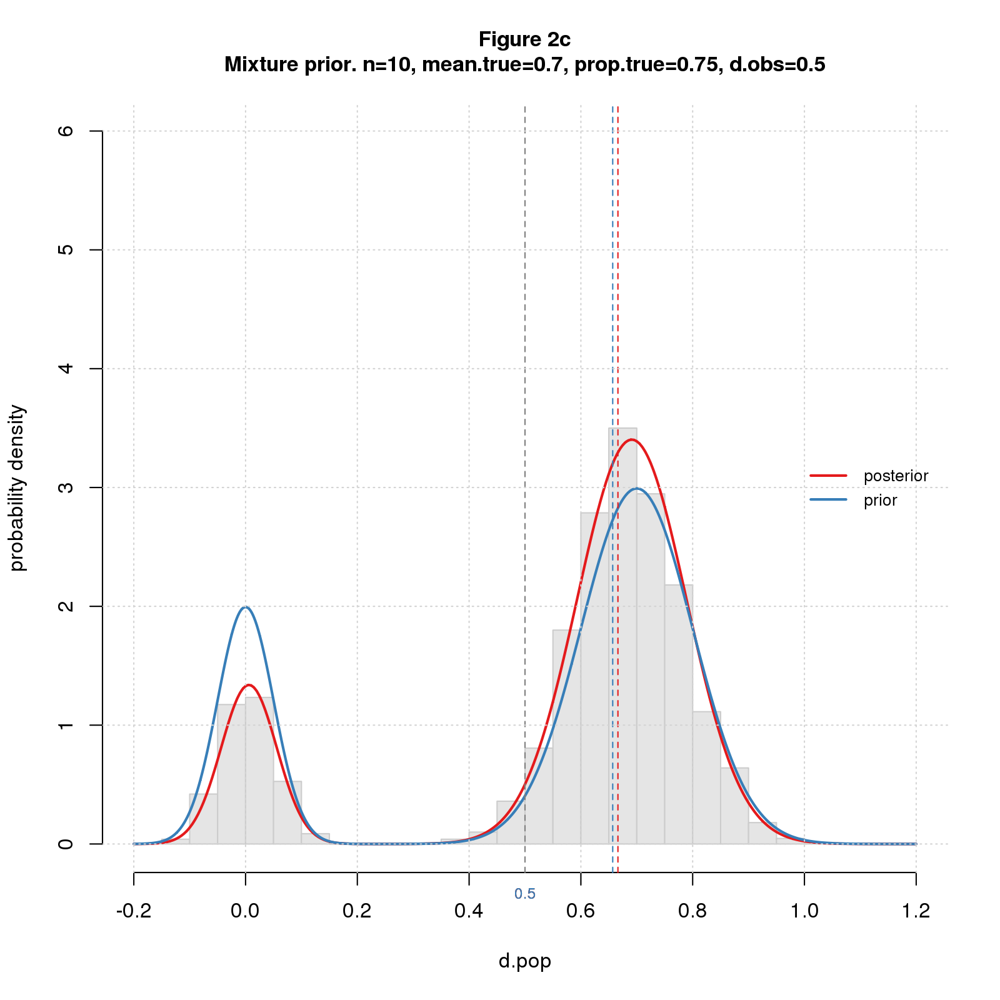
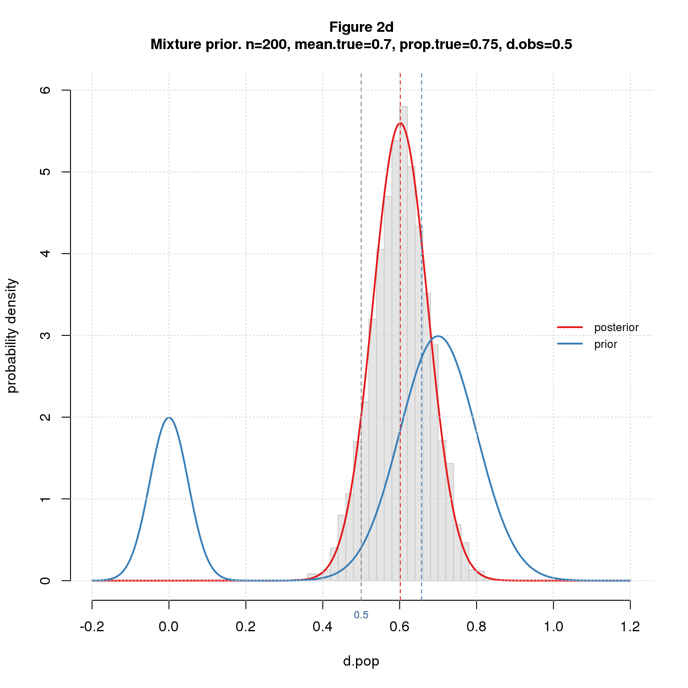

*What's the true effect size? That's my bottom line question when doing a study or reading a paper. I don't expect an exact answer, of course - this is statistics after all. What I want is a probability distribution telling where the true effect size probably lies. I used to think confidence intervals answered this question, but they don't except under artificial conditions. A better answer comes from Bayes's formula. But caveat emptor: the answer depends on what you expect it to be.*

Confidence intervals, like other standard methods such as the t-test, imagine that we're repeating a study an infinite number of times, drawing a different sample each time from the same population. That's not how I do science, or rather, it's not how I do basic, exploratory research. What I do is run a study, compute an observed effect size from my data, and try to figure out what true effect size may have led to my observation. Mathematically, I consider all possible true effect sizes and ask, "What's the probability of getting my result for each true effect size?". 

I model the scenario as a two stage random process. The first stage selects a population (aka "true") effect size, $d_{pop}$, from a distribution; the second carries out a study with that population effect size yielding an observed effect size, $d_{obs}$. Imagine I repeat the process infinitely, recording $d_{pop}$ and $d_{obs}$ each time. The result is a table with columns $d_{pop}$ and $d_{obs}$ showing which $d_{pop}$s give rise to which $d_{obs}$s. Now, pick a value for $d_{obs}$, say $0.5$, and limit the table to rows where $d_{obs}$ is near $0.5$. The distribution of $d_{pop}$ from this subset is the answer to my question. In Bayesian-speak, the first-stage distribution is the *prior*, and the final distribution is the *posterior*.

For this post, the studies in the second stage are simple two group difference-of-mean studies with equal sample size and standard deviation, and the effect size statistic is standardized difference (aka *Cohen’s d*). Concretely, each study selects two random samples of size $n$ from standard normal distributions, one with $mean=0$ and the other with $mean=d_{pop}$, and calculates $d_{obs}$ as the difference of the group means divided by the pooled standard deviation.

Now for the cool bit. The Bayesian approach lets us pick a prior that represents our best guess of the distribution of true effect sizes in our research field. From what I read in the blogosphere, the typical population effect size in social science research is $0.3$. I'll model this as a normal distribution with $mean=0.3$ and small standard deviation, say $0.1$. I'll also look at priors with $mean=0.7$ to illustrate the impact of the choice.

Figures 1a-d show the results for small and large samples ($n=10$ or $200$) and small and large priors ($mean=0.3$ or $0.7$) for $d_{obs}=0.5$. Each figure shows a histogram of simulated data, the prior and posterior distributions (blue and red curves), the medians of the two distributions (blue and red dashed vertical lines), and $d_{obs}=0.5$ (gray dashed vertical line).

```{r out.width="50%",echo=FALSE,fig.show='asis'}
knitr::include_graphics('figure/effit/figure_001a_norm_lo_lo.png');
;
;
;
```

The posteriors and histograms match pretty well, a good sign that my software works. For $n=10$ (the left column), the posterior mean is almost equal to the prior, while for $n=200$ (the right column), it's much closer to the observed ($0.5$). For $mean=0.3$ (the top row), the prior pulls the posterior down, while for $mean=0.7$ (the bottom row), it pulls it up.

It's a tug-of-war: for small samples, the prior wins and pulls the posterior strongly toward itself; for large samples, the data is stronger and keeps the posterior closer to the observation. Completely intuitive.

But wait. I forgot an important fact: some of the problems we study are "false" ("satisfy the null") with effect sizes of 0 or close to 0, while others are "true" with effect sizes as above. No worries. I model the "false" effect sizes as normal with $mean=0$ and very small standard deviation, say $0.05$, and the totality of effect sizes as a *mixture* of this distribution and the "true" one. To complete the model, I have to specify the proportion of "true" vs. "false" problems: I use 50:50 for the post; the results are qualitatively similar for proportions above 10% (data not shown).

Figures 2a-d show the results. The priors are bimodal, reflecting the two classes. 

```{r out.width="50%",echo=FALSE,fig.show='asis'}
;
;
;
;
```

For small samples, the posterior is also bimodal, which means the data does a terrible job of distinguishing true and false cases. For big samples, the posterior is unimodal. While the prior pulls the result toward itself, the result is not too far from the data and remains clearly in "true" territory. 

These results are simple, intuitive, and reasonable. The code for the core Bayesian analysis (available [here](https://natgoodman.github.io/bayez/baysx.stable.html)) is simple, too, just a few lines of R. 

Why this isn't the standard way to estimate true effect size? The devil is in the priors. Reasonable scientists might choose different priors making it hard to compare results across studies. Unscrupulous scientists can choose priors that give whatever answers they want, akin to p-hacking but probably harder to rebut. 

For this elegant method to become the norm, something has to be done about the priors. Perhaps research communities could adopt standard priors for specific types of studies. Maybe we can use the data from reproducibility projects to inform these choices. It seems technically feasible. What's lacking is the will to make the change. I'm not holding my breath.

## Comments Please!

Please post comments on [Twitter](https://twitter.com/gnatgoodman) or [Facebook](https://www.facebook.com/nathan.goodman.3367), or contact me by email [natg@shore.net](mailto:natg@shore.net).
