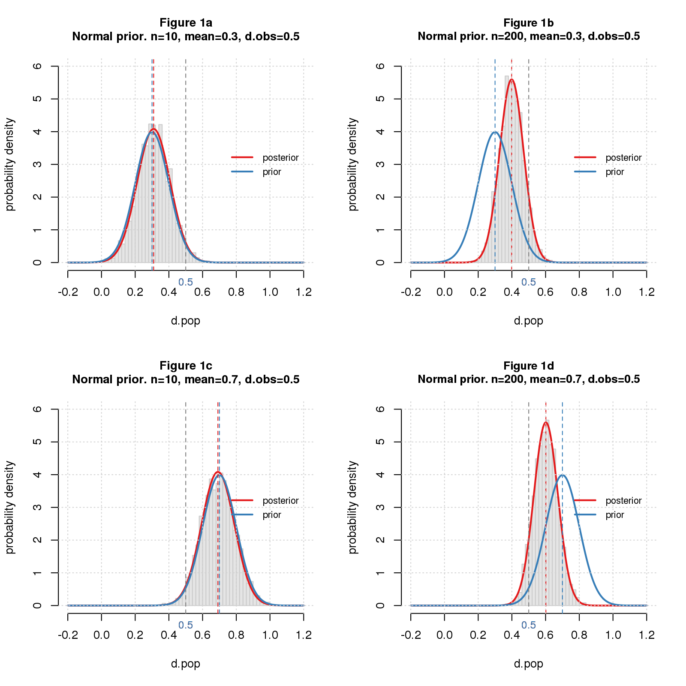
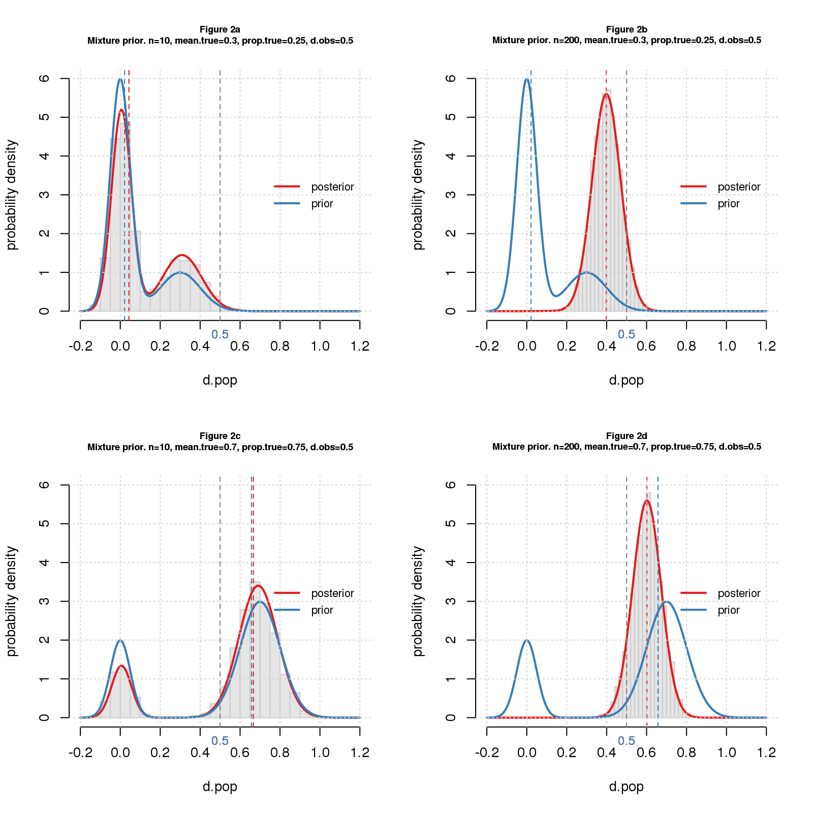

*What's the true effect size? That's my bottom line question when doing a study or reading a paper. I don't expect an exact answer, of course. What I want is a probability distribution telling where the true effect size probably lies. I used to think confidence intervals answered this question, but they don't except under artificial conditions. A better answer comes from Bayes's formula. But beware of the devil in the priors.*

Confidence intervals, like other standard methods such as the t-test, imagine we're repeating a study an infinite number of times, drawing a different sample each time from the same population. That seems unnatural for basic, exploratory research, where the usual practice is to run a study once (or maybe twice for confirmation). 

As I looked for a general way to estimate true effect size from studies done once, I fell into Bayesian analysis. Much to my surprise, this proved to be simple and intuitive. The code for the core Bayesian analysis (available [here](https://natgoodman.github.io/bayez/baysx.stable.html)) is simple, too: just a few lines of R. The main drawback is the answer depends on your prior expectation. Upon reflection, this drawback may really be a strength, because it forces you to articulate key assumptions.

Being a programmer, I always start with simulation when learning a new statistical method. I model the scenario as a two stage random process. The first stage selects a population (aka "true") effect size, *d~pop~*, from a distribution; the second carries out a study with that population effect size yielding an observed effect size, *d~obs~*. The studies are simple two group difference-of-mean studies with equal sample size and standard deviation, and the effect size statistic is standardized difference (aka *Cohen’s d*). I record *d~pop~* and *d~obs~* from each simulation producing a table showing which *d~pop~*s give rise to which *d~obs~*s. Then I pick a target value for *d~obs~*, say *0.5*, and limit the table to rows where *d~obs~* is near *0.5*. The distribution of *d~pop~* from this subset is the answer to my question. In Bayesian-speak, the first-stage distribution is the *prior*, and the final distribution is the *posterior*.

Now for the cool bit. The Bayesian approach lets us pick a prior that represents our assumptions about the distribution of effect sizes in our research field. From what I read in the blogosphere, the typical population effect size in social science research is *0.3*. I model this as a normal distribution with *mean=0.3* and small standard deviation, *0.1*. I also do simlulations with a bigger prior, *mean=0.7*, to illustrate the impact of the choice.

Figures 1a-d show the results for small and large samples (*n=10* or *200*) and small and big priors for *d~obs~=0.5*. Each figure shows a histogram of simulated data, the prior and posterior distributions (blue and red curves), the medians of the two distributions (blue and red dashed vertical lines), and *d~obs~* (gray dashed vertical line).

```{r echo=FALSE,fig.show='asis'}
;
```

The posteriors and histograms match pretty well, indicating my software works. For *n=10* (left column), the posterior is almost identical to the prior, while for *n=200* (right column), it's shifted toward the observed. It's a tug-of-war: for small samples, the prior wins, while for large samples, the data is stronger and keeps the posterior closer to the observation. The small prior (top row) pulls the posterior down; the big one (bottom row) pushes it up. Completely intuitive.

But wait. I forgot an important detail: some of the problems we study are "false" ("satisfy the null"). No worries. I model the null effect sizes as normal with *mean=0* and very small standard deviation, *0.05*, and the totality of effect sizes as a *mixture* of this distribution and the "true" ones as above. To complete the model, I have to specify the proportion of true vs. null problems. To illustrate the impact, I use 25% true for the small prior and 75% for the big one.

Figures 2a-d show the results. 

```{r echo=FALSE,fig.show='asis'}
;
```

The priors have two peaks, reflecting the two classes. With 25% true (top row), the false peak is tall and the true peak short; with 75% true (bottom row), it's the opposite though not as extreme. For small samples (left column), the posterior also has two peaks, indicating that the data does a poor job of distinguishing true from null cases. For big samples (right column), the posterior has a single peak, which is clearly in true territory. As in Figure 1, the small prior (top row) pulls the result down, while the bigger one (bottom row) pushes it up. Again completely intuitive.

What's not to like?

The devil is in the priors. Small priors yield small answers; big priors yield bigger ones. Assumptions about the proportion of true vs. null problems amplify the impact. Reasonable scientists might choose different priors making it hard to compare results across studies. Unscrupulous scientists may choose priors that make their answers look better, akin to p-hacking. 

For this elegant method to become the norm, something has to be done about the priors. Perhaps research communities could adopt standard priors for specific types of studies. Maybe we can use data from reproducibility projects to inform these choices. It seems technically feasible. No doubt I've missed some important details, but this seems a promising way to move beyond p-values.

## Comments Please!

Please post comments on [Twitter](https://twitter.com/gnatgoodman) or [Facebook](https://www.facebook.com/nathan.goodman.3367), or contact me by email [natg@shore.net](mailto:natg@shore.net).
